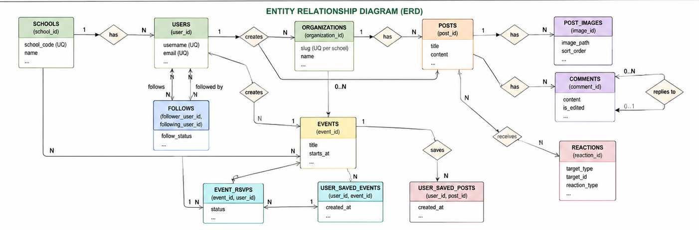
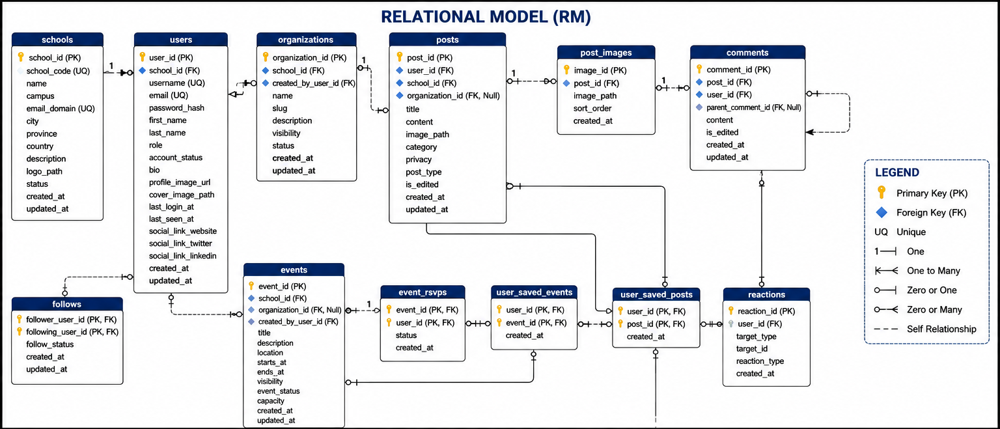

# CampusLink

**CampusLink** is a web-based school community platform built with Flask and MySQL. It connects students, staff, and administrators across campuses through posts, events, profiles, organizations, and search — designed as an academic project for **Information Management 1**.

---

## Table of Contents

1. [Introduction](#a-introduction)
2. [Project Objectives](#b-project-objectives)
3. [Business Rules](#c-business-rules)
4. [Database Models](#d-database-models)
5. [Project Overview](#e-project-overview)
6. [Setup Instructions](#f-setup-instructions)
7. [Team Members & Roles](#g-team-members--roles)
8. [Dependencies](#h-dependencies)
9. [Running Instructions](#i-running-instructions)

---

## a. Introduction

### Background

Colleges and universities often rely on scattered tools — group chats, social media, email, and paper notices — to share campus news, events, and student activity. Information is fragmented across platforms, hard to search, and not always scoped to a specific school or role.

**CampusLink** was created to provide a single, school-aware web application where authenticated users can post updates, discover events, manage profiles, follow peers, and (for administrators) moderate content and manage schools. The project demonstrates full-stack development: a Python/Flask backend, a MySQL relational database, and a responsive Bootstrap 5 front end.

### Problem Statement

The application addresses these specific challenges:

- **Fragmented communication** — Campus announcements and student posts are spread across unofficial channels with no school-level filtering.
- **Poor discoverability** — Students struggle to find events, clubs, and classmates without a unified search and profile system.
- **Weak access control** — Public tools do not distinguish between guests, students, staff, and administrators, or enforce school-scoped visibility.
- **No centralized moderation** — Inappropriate posts or unpublished events lack an admin workflow for review and approval.
- **Manual data management** — Schools, users, and content need structured CRUD operations backed by a normalized database.

### Scope

**In scope:**

- User registration, login, and session-based authentication
- School-scoped social feed (posts, comments, likes)
- Events (create, RSVP, save/bookmark, admin approval of drafts)
- User profiles (avatar, cover, bio, social links, followers)
- Organizations listing on profiles
- Global search (schools, users, posts, events) with visibility rules
- Admin moderation panel and school management (admin role)
- MySQL database with schema, seed data, and migration scripts

**Out of scope:**

- Native mobile apps (iOS/Android)
- Real-time chat or push notifications
- Payment processing or ticketing
- Email verification and password-reset flows (not implemented)
- Full followers-only post sharing (followers-only posts are primarily author-visible until extended)
- Production deployment automation (Docker, CI/CD) — local/XAMPP setup only

### Target Users

| User type | How they benefit |
|-----------|------------------|
| **Students** | Share posts, join events, build a profile, follow classmates, and search campus content for their school. |
| **Staff** | Same as students; may create organization-linked content where applicable. |
| **Administrators** | Manage schools, moderate users/posts/events, approve draft events, and oversee platform health. |
| **Guests (not signed in)** | Browse public landing content, public posts, and public published events; must register to participate. |

---

## b. Project Objectives

### Primary Objective

Build a secure, school-aware **campus social networking web application** that stores data in MySQL and provides role-based features for students and administrators through a modern, responsive interface.

### Secondary Objectives

| Area | Objective |
|------|-----------|
| **Database connectivity** | Connect Flask to MySQL using environment-based configuration (`MYSQL_*` variables) with reliable connection handling and parameterized queries. |
| **User interface** | Deliver a responsive Bootstrap 5 UI with reusable templates, macros (avatars, follow buttons), lightbox media, and accessible forms. |
| **Data management** | Implement CRUD for posts, events, schools (admin), profiles, comments, reactions, RSVPs, and saved items with validation and referential integrity. |
| **Search functionality** | Provide keyword search across schools, users, posts, and events with school/role/category filters and pagination. |

---

## c. Business Rules

### Detailed Business Logic

#### User authentication

- New registrations create accounts with `role = student` and `account_status = active`.
- Passwords are hashed with **Werkzeug** (`pbkdf2:sha256`); plain-text passwords are never stored.
- Login requires a valid username and password and an **active** account status.
- Sessions use Flask’s **signed cookie** (`session['user_id']`); optional “Stay signed in” sets a permanent session (14-day lifetime).
- Protected routes use `@login_required`; unauthenticated users are redirected to login with a flash message.
- Sign-out clears the session.

#### Database connection settings

- Connection parameters are read from `.env`: `MYSQL_HOST`, `MYSQL_PORT`, `MYSQL_USER`, `MYSQL_PASSWORD`, `MYSQL_DATABASE`.
- Default database name in schema/seed files is **`CCCS105`** (must match `.env`).
- Failed connections return `None` and surface user-friendly flash messages (e.g., “Cannot reach the database”).

#### CRUD operation constraints

- **Posts:** Authors and admins may edit/delete; guests see only `public` posts; signed-in users see school-scoped and their own private/followers-only posts per visibility rules.
- **Events:** Creators and admins may edit/delete; new events default to `draft` until published; admins may approve drafts from the moderation panel.
- **Schools:** Admin-only create/update/delete; delete blocked if users still reference the school (`ON DELETE RESTRICT`).
- **Profiles:** Users may edit only their own profile; images stored under `src/static/uploads/profiles/` (max **3 MB**, PNG/JPG/JPEG/WebP/GIF).
- **Comments:** Users delete their own comments; admins may delete any.
- **RSVPs:** Signed-in users join events (`going` or `waitlist` if at capacity) or cancel attendance.

#### Data validation rules

- Usernames: alphanumeric + underscore, minimum length enforced on registration/edit.
- Emails: valid format, unique per user.
- Bio, post content, event titles/dates: length and required-field checks via validation modules (`utils/profile_validation.py`, `utils/post_validation.py`, `utils/event_validation.py`, etc.).
- Event dates: end time must be ≥ start time; publishing may require a future start time (validation in `utils/event_validation.py`).
- Search keywords: SQL `LIKE` wildcards escaped via `utils/search_helpers.py`.

#### Access control levels

| Role | Permissions (summary) |
|------|------------------------|
| **Guest** | View landing, public feed/events, register, login. |
| **Student / Staff** | Create posts/events, profile edit, RSVP, comment, like, follow, search (school-scoped where applicable). |
| **Admin** | All student capabilities plus school CRUD, moderation dashboard, user role/status edits, post deletion, event approval. |

Admin routes use `@admin_required` or `enforce_admin_access()` on the admin blueprint’s `before_request` hook.

### Constraints

- **Technical:** Python 3.x, Flask 3.x, MySQL 8.x (or MariaDB compatible), browser with JavaScript enabled for previews/lightbox/follow toggles.
- **Storage:** Uploaded files live on the local filesystem under `src/static/uploads/` (not cloud storage).
- **Security:** `SECRET_KEY` must be set in production; `SESSION_COOKIE_SECURE=true` only over HTTPS.
- **Operational:** Single-server development model (Flask built-in server); not intended for high-traffic production without a WSGI server (e.g., Gunicorn).

### Conditions

- **Session handling:** Active users have `last_seen_at` updated periodically (about every 120 seconds) while browsing.
- **Account status:** Suspended or deactivated users cannot use protected features; non-active profiles are hidden from other users.
- **Admin safety:** The last active admin cannot be demoted or deactivated via the admin user form.
- **Database:** MySQL service must be running before starting the app; schema and seed (or migrations) must be applied first.
- **Environment:** A `.env` file must exist in the project root with correct `MYSQL_DATABASE` matching the imported schema.

---

## d. Database Models

### Entity Relationship Diagram (ERD)



The ERD shows how core entities relate:

- **Schools** host **users**, **organizations**, **posts**, and **events**.
- **Users** author **posts** and **comments**, create **events**, **follow** other users, and **react** to posts/comments.
- **Posts** may link to an **organization** and have optional **post_images** and **user_saved_posts**.
- **Events** support **event_rsvps** and **user_saved_events**.
- **Comments** support threading via `parent_comment_id`.

Place the ERD image at `docs/diagrams/erd.png` (create the `docs/diagrams/` folder if needed).

### Relational Model



Place the relational model diagram at `docs/diagrams/rm.png`.

#### Tables and attributes

| Table | Key attributes |
|-------|----------------|
| **schools** | `school_id` (PK), `school_code`, `name`, `campus`, `email_domain`, `city`, `province`, `country`, `description`, `logo_path`, `status`, `created_at`, `updated_at` |
| **users** | `user_id` (PK), `school_id` (FK), `username`, `email`, `password_hash`, `first_name`, `last_name`, `role`, `account_status`, `bio`, `profile_image_url`, `cover_image_path`, `last_login_at`, `last_seen_at`, social link fields, timestamps |
| **organizations** | `organization_id` (PK), `school_id` (FK), `created_by_user_id` (FK), `name`, `slug`, `description`, `visibility`, `status`, timestamps |
| **posts** | `post_id` (PK), `title`, `user_id` (FK), `school_id` (FK), `organization_id` (FK, nullable), `content`, `image_path`, `category`, `privacy`, `post_type`, `is_edited`, timestamps |
| **post_images** | `image_id` (PK), `post_id` (FK), `image_path`, `sort_order`, `created_at` |
| **user_saved_posts** | `user_id` + `post_id` (PK), `created_at` |
| **comments** | `comment_id` (PK), `post_id` (FK), `user_id` (FK), `parent_comment_id` (FK, nullable), `content`, `is_edited`, timestamps |
| **reactions** | `reaction_id` (PK), `user_id` (FK), `target_type`, `target_id`, `reaction_type`, `created_at` |
| **events** | `event_id` (PK), `school_id` (FK), `organization_id` (FK, nullable), `created_by_user_id` (FK), `title`, `description`, `location`, `starts_at`, `ends_at`, `visibility`, `event_status`, `capacity`, timestamps |
| **event_rsvps** | `event_id` + `user_id` (PK), `status`, `created_at` |
| **user_saved_events** | `user_id` + `event_id` (PK), `created_at` |
| **follows** | `follower_user_id` + `following_user_id` (PK), `follow_status`, timestamps |

Full DDL: `database/schema.sql`. Sample data: `database/initial_data.sql`. Incremental updates: `database/migrations/`.

---

## e. Project Overview

### Architecture and design pattern

CampusLink follows a **Model–View–Controller (MVC)–inspired** structure adapted for Flask:

| Layer | Implementation |
|-------|----------------|
| **Model** | MySQL tables + SQL access in route handlers via `utils/db.py` (`db_cursor`, `get_connection`) |
| **View** | Jinja2 templates in `src/templates/` (Bootstrap 5, macros, partials) |
| **Controller** | Flask **Blueprints** in `src/routes/` (`auth`, `posts`, `events`, `profiles`, `schools`, `admin`, `search`, `main`) |

Configuration is centralized in `src/config.py` (loaded from `.env`). Cross-cutting concerns live in `src/utils/` (auth, validation, uploads, search helpers, session middleware).

### Key components

```
CampusLink/
├── database/           # schema.sql, initial_data.sql, migrations/
├── docs/diagrams/      # erd.png, rm.png
├── src/
│   ├── app.py          # Application factory, blueprint registration
│   ├── config.py       # Environment-based settings
│   ├── routes/         # URL handlers (blueprints)
│   ├── templates/      # HTML views + macros
│   ├── static/         # CSS, JS, uploads
│   └── utils/          # DB, auth, validation, uploads
├── .env.example
└── requirements.txt
```

- **`src/app.py`** — Creates the Flask app, registers blueprints, 404 handler, template globals.
- **`src/utils/session_middleware.py`** — Loads `g.current_user` on each request; updates `last_seen_at`.
- **`src/utils/auth_helpers.py`** — `login_required`, `admin_required`, password/session helpers.
- **`src/static/`** — Front-end assets; user uploads under `uploads/profiles/`, `uploads/posts/`, `uploads/schools/`.

---

## f. Setup Instructions

### Prerequisites

| Requirement | Notes |
|-------------|--------|
| **Python** | 3.10+ recommended |
| **MySQL** | 8.0+ (or **XAMPP** / MariaDB with MySQL compatibility) |
| **Git** | To clone the repository |
| **Web browser** | Chrome, Firefox, or Edge (latest) |
| **pip** | Python package manager (included with Python) |

### Step-by-step installation

#### 1. Clone the repository

```bash
git clone <repository-url>
cd CampusLink
```

#### 2. Create and activate a virtual environment

**Windows (PowerShell):**

```powershell
python -m venv venv
venv\Scripts\activate
```

**macOS / Linux:**

```bash
python3 -m venv venv
source venv/bin/activate
```

#### 3. Install dependencies

```bash
pip install -r requirements.txt
```

#### 4. Configure and import the database

1. Start **MySQL** (or XAMPP MySQL).
2. Create the database if it does not exist (schema uses `CCCS105`):

```sql
CREATE DATABASE IF NOT EXISTS CCCS105 CHARACTER SET utf8mb4 COLLATE utf8mb4_unicode_ci;
```

3. Import schema and seed data from the project root:

**Windows (PowerShell):**

```powershell
Get-Content database\schema.sql | mysql -u root -p
Get-Content database\initial_data.sql | mysql -u root -p
```

**macOS / Linux:**

```bash
mysql -u root -p < database/schema.sql
mysql -u root -p < database/initial_data.sql
```

4. If upgrading an older database, run migration scripts in `database/migrations/` in order (`001` through `005`), ensuring each file’s `USE` line matches your database name.

#### 5. Set environment variables

```bash
# Windows
copy .env.example .env

# macOS / Linux
cp .env.example .env
```

Edit `.env`:

```env
SECRET_KEY=your-random-secret-key
MYSQL_HOST=localhost
MYSQL_PORT=3306
MYSQL_USER=root
MYSQL_PASSWORD=your_mysql_password
MYSQL_DATABASE=CCCS105
SESSION_COOKIE_SECURE=false
```

`MYSQL_DATABASE` **must** match the database used in `schema.sql` and `initial_data.sql`.

#### 6. Run the application

From the project root with the virtual environment activated:

```bash
python src/app.py
```

#### 7. Access in the browser

Open: **http://127.0.0.1:5000/**

---

## g. Team Members & Roles

| Member | Role | Responsibilities |
|--------|------|------------------|
| **Jian Alvarez** | Developer — Backend & data | Database design, Flask routes, MySQL integration, API-style route logic, testing data flows |
| **Christian Sta. Cruz** | Developer — UX & frontend | UI/UX design, Bootstrap layouts, templates, CSS/JS, responsive behavior |
| **Victoria Alano** | Developer — Product & platform | Feature coordination, profiles/settings, documentation, QA and integration |

*Course: Information Management 1 · Academic project · v1.0.0*

---

## h. Dependencies

### Python packages

| Package | Version (tested) |
|---------|-------------------|
| Flask | 3.1.3 |
| mysql-connector-python | 9.7.0 |
| python-dotenv | 1.2.2 |
| Werkzeug | 3.1.8 |

Install all via:

```bash
pip install -r requirements.txt
```

### System requirements

| Component | Requirement |
|-----------|-------------|
| **OS** | Windows 10/11, macOS, or Linux |
| **Python** | 3.10 or newer |
| **MySQL** | 8.0+ (or MariaDB 10.4+ / XAMPP) |
| **RAM** | 4 GB minimum recommended for local dev |
| **Browser** | Modern evergreen browser with JavaScript enabled |
| **Disk** | ~200 MB for venv, dependencies, and uploads |

---

## i. Running Instructions

### Start the application

1. Activate the virtual environment.
2. Ensure MySQL is running and `.env` is configured.
3. From the project root:

```bash
python src/app.py
```

4. Open **http://127.0.0.1:5000/** in your browser.

Debug mode is enabled when running `app.py` directly (auto-reload on code changes).

### Stop the application

In the terminal where Flask is running, press **`Ctrl+C`**.

### Default login credentials

After running `database/initial_data.sql`:

| Role | Username | Password |
|------|----------|----------|
| **Admin** | `admin_allan` | `AdminCampus123!` |
| **Student** | `Christian_student` | `CampusLink123!` |
| **Student** | `victoria_student` | `CampusLink123!` |
| **Student** | `jian_student` | `CampusLink123!` |

> Change these passwords if deploying beyond local development.

### Using the application

| Feature | How to access |
|---------|----------------|
| **Home / landing** | `/` — overview and registration CTA |
| **Register** | `/register` — create a student account |
| **Login** | `/login` — sign in (optional “Stay signed in”) |
| **Dashboard** | `/dashboard` — signed-in home |
| **Campus feed** | `/feed` — posts, comments, likes; filter by school |
| **Create post** | `/posts/new` — new post with category and privacy |
| **Events** | `/events/upcoming` — browse; `/events/new` to create |
| **Event detail** | `/events/<id>` — RSVP, save event |
| **Profile** | `/u/<username>` or `/profile/<user_id>` — tabs: Posts, Events, Organizations, Saved |
| **Edit profile** | `/profile/edit` — photos, bio, password |
| **Settings** | `/settings` — account links |
| **Search** | `/search` — keyword search with filters |
| **Schools (admin)** | `/schools` — CRUD for schools |
| **Moderation (admin)** | `/admin/dashboard` — users, posts, pending events |
| **About** | `/about` — project and team information |

**Typical student flow:** Register → Log in → Complete profile → Browse feed → Create a post → RSVP to an event → Follow classmates from their profiles.

**Typical admin flow:** Log in as admin → Open **Moderation** → Approve draft events / manage users → Manage **Schools** as needed.

---

## Project structure (reference)

| Path | Purpose |
|------|---------|
| `docs/diagrams/` | ERD and relational model images |
| `database/` | SQL schema, seed data, migrations |
| `src/` | Flask application source |
| `src/routes/` | Blueprint controllers |
| `src/templates/` | Jinja2 HTML views |
| `src/static/` | CSS, JavaScript, uploaded media |
| `src/utils/` | Shared helpers (DB, auth, validation) |

---

## License & academic use

CampusLink is developed as an **academic project** for Information Management 1. Use and distribution should follow your institution’s guidelines.
